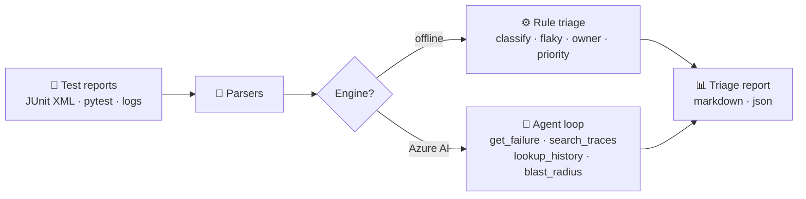

# AI Failure Analysis & Agentic Triage

Stop reading stack traces by hand. This tool ingests test failures, classifies them,
detects flakes, routes them to owners, and — with Azure AI — sends a tool-calling
agent to investigate each failure like a senior SDET would.

🌐 **Live demo:** https://dharshuadhi.github.io/ai-failure-triage/

## How it works



**Step by step:**

1. **Feed it failures** — a JUnit XML report, `pytest` output, or raw logs (file, glob, or folder).
2. **Pick an engine** — `auto` uses the Azure AI agent when credentials exist, otherwise the offline rule engine.
3. **Rule triage** classifies every failure (timeout, locator, connection, assertion, setup),
   checks run history for flakiness, suggests an owner from your team map, and assigns P1–P4.
4. **The AI agent** (optional) investigates each failure with tools: it reads stack traces,
   looks up history, and searches for systemic patterns across failures — then writes a root-cause verdict.
5. **Get the report** — Markdown triage report or JSON, sorted by priority.

## CLI

```bash
pip install -r requirements.txt

# Basic: triage a JUnit report
python -m src.cli -i examples/sample_results.xml

# With history (flaky detection) + owners, write to file
python -m src.cli -i results.xml --history history.json --owners owners.json -o triage.md

# Whole folder, JSON output, offline engine
python -m src.cli -i reports/ --format json --engine rule

# AI bug reports, one per cluster
python -m src.cli -i results.xml --bug-reports ./bugs/

# Compare against last week's baseline
python -m src.cli -i results.xml --format json -o this-week.json --engine rule
python -m src.cli -i results.xml --baseline last-week.json --engine rule

# Record the run and see the flaky leaderboard (Redis if --redis-url given)
python -m src.cli -i results.xml --analytics --redis-url redis://localhost:6379

# AI agent (needs Azure OpenAI in .env)
cp .env.example .env
python -m src.cli -i results.xml --engine ai
```

`history.json` maps test ids to recent runs — `{"tests.test_x::test_y": ["pass","fail","pass"]}`.
`owners.json` maps test-id prefixes to teams — `{"tests.test_api": "platform-team", "*": "qa-oncall"}`.

## Features

### Triage core
- 🔎 **Multi-format parsers** — JUnit XML, pytest text output, raw stack-trace logs
- 🏷️ **Failure classification** — timeout, locator, connection, assertion, setup
- 🌊 **Flaky detection** — pass/fail history marks intermittent tests for quarantine
- 👥 **Owner routing** — prefix-based team mapping
- 🎯 **Priority assignment** — systemic outages hit P1, flakes get quarantined at P3

### Deep analysis
- 🧬 **Stack-trace fingerprinting** — Sentry-style normalization (line numbers, addresses,
  timestamps stripped) hashes each failure so one bug = one group, however many tests hit it
- 📈 **Failure analytics on Redis** — per-test daily pass/fail **bitmaps** for flake-rate
  computation, **HyperLogLog** for distinct failing tests in ~12KB; graceful in-memory
  fallback when Redis isn't available. Leaderboards rank your flakiest tests.
- 📝 **Bug-report drafts** — one paste-ready markdown report per cluster: title, priority,
  affected tests, root cause, evidence
- 📉 **Baseline diff** — compare this run against a previous report to spot regressions

### AI
- 🤖 **Tool-calling AI agent** — investigates with `get_failure`, `search_traces`,
  `lookup_history`, `blast_radius`

### Interfaces
- 📊 **Reports** — Markdown triage report or JSON, sorted by priority
- 🌐 **Browser demo** — offline triage running entirely in the page

## Project structure

```
src/
  cli.py          argument parsing, input collection
  pipeline.py     orchestration: parse -> triage -> results
  parsers.py      JUnit XML / pytest text / log parsers
  rule_triage.py  classifier, flaky detection, owners, priorities
  fingerprint.py  stack-trace normalization + hashing -> failure clusters
  analytics.py    Redis bitmap/HyperLogLog failure analytics (+memory fallback)
  bugreports.py   bug-report drafts + baseline diff
  agents.py       Azure OpenAI tool-calling investigation loop
  tools.py        agent tools (traces, history, blast radius)
  reporters.py    Markdown + JSON report renderers
docs/             browser demo (GitHub Pages)
examples/         sample report, history, owners
tests/            unit tests
```

## Tests

```bash
python -m unittest discover -s tests -v
```

## License

MIT — see [LICENSE](LICENSE).
